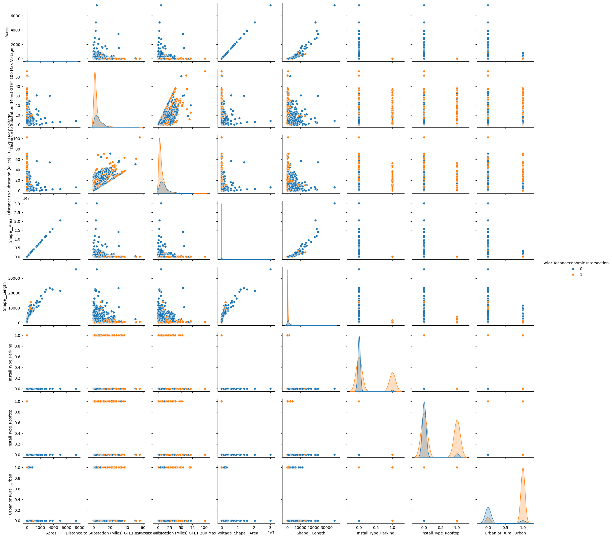

# Solar Energy Consumption Analysis using Machine Learning


---

## Project Overview

This project analyzes solar energy consumption patterns using machine learning techniques to identify predictive trends and evaluate classification performance. The workflow includes data preprocessing, exploratory data analysis, handling imbalanced data using SMOTE, hyperparameter tuning with GridSearchCV, and model evaluation using multiple classification metrics.

The project demonstrates an end-to-end machine learning pipeline built using Python and Scikit-learn.

---

## Key Highlights

- Implemented multiple machine learning classification models
- Applied SMOTE to handle imbalanced data
- Performed hyperparameter tuning using GridSearchCV
- Conducted exploratory data analysis and correlation analysis
- Evaluated model performance using standard classification metrics
- Built a complete end-to-end machine learning workflow

---

## Business Problem

Understanding solar energy consumption and sustainability-related patterns is important for improving renewable energy optimization and decision-making. This project focuses on analyzing solar footprint-related data to identify meaningful relationships and predictive insights using machine learning models.

---

## Machine Learning Models Used

The following classification models were implemented and evaluated:

- Logistic Regression
- K-Nearest Neighbors (KNN)
- Support Vector Classifier (SVC)
- Multi-Layer Perceptron (MLP)
- Random Forest Classifier

---

## Tech Stack

| Category | Tools & Libraries |
|---|---|
| Programming Language | Python |
| Data Processing | Pandas, NumPy |
| Visualization | Matplotlib, Seaborn |
| Machine Learning | Scikit-learn |
| Imbalanced Data Handling | SMOTE |
| Experiment Tracking | MLflow |
| Notebook Environment | Jupyter Notebook |

---

## Project Workflow

1. Data Collection & Loading  
2. Data Cleaning & Preprocessing  
3. Exploratory Data Analysis (EDA)  
4. Handling Imbalanced Data using SMOTE  
5. Model Training & Hyperparameter Tuning  
6. Model Evaluation & Performance Analysis  

---

## Correlation Heatmap

The correlation heatmap below highlights relationships between important variables in the dataset and supports feature analysis during the machine learning workflow.



---

## Repository Structure

```text
solar-energy-consumption-analysis/
│
├── data/
│   └── solar_footprints.csv
│
├── images/
│   └── correlation_heatmap.png
│
├── notebooks/
│   └── solar_footprint_analysis.ipynb
│
├── README.md
├── requirements.txt
└── .gitignore
```

---

## Notebook

Access the complete implementation here:

[Open Jupyter Notebook](notebooks/solar_footprint_analysis.ipynb)

---

## Requirements

Install the required Python libraries using:

```bash
pip install -r requirements.txt
```

### Required Libraries

```text
numpy
pandas
matplotlib
seaborn
scikit-learn
imbalanced-learn
jupyter
mlflow
```

---

## Installation & Setup

### Clone Repository

```bash
git clone https://github.com/lokeshadda/solar-energy-consumption-analysis.git
```

### Navigate to Project Directory

```bash
cd solar-energy-consumption-analysis
```

### Install Dependencies

```bash
pip install -r requirements.txt
```

### Launch Jupyter Notebook

```bash
jupyter notebook
```

---

## Results Summary

- Multiple machine learning models were trained and evaluated
- Hyperparameter tuning was performed using GridSearchCV
- SMOTE was applied to address class imbalance
- Classification performance was evaluated using Accuracy, Precision, Recall, F1-Score, and ROC-AUC metrics

---

## Model Performance Insights

Multiple machine learning models were trained and evaluated using classification metrics such as Accuracy, Precision, Recall, F1-Score, and ROC-AUC Score.

Among the evaluated models, the **Random Forest Classifier** demonstrated the strongest overall performance due to its ability to handle complex feature relationships and reduce overfitting through ensemble learning techniques.

Key observations:
- Random Forest achieved the most balanced classification performance across evaluation metrics
- SMOTE improved model learning by addressing class imbalance
- Hyperparameter tuning using GridSearchCV enhanced model optimization
- Logistic Regression provided strong baseline interpretability
- MLP and SVC models demonstrated competitive performance but required higher computational complexity

---

## Future Enhancements

- Deploy models using Streamlit or Flask
- Add advanced feature engineering techniques
- Integrate real-time renewable energy datasets
- Build interactive dashboards for visualization
- Implement automated machine learning pipelines

---

## Author

### Lokesh Adda

Graduate Student in Business Analytics & Information Systems  
Focused on Data Analytics, Machine Learning, Data Governance, and Business Intelligence.
